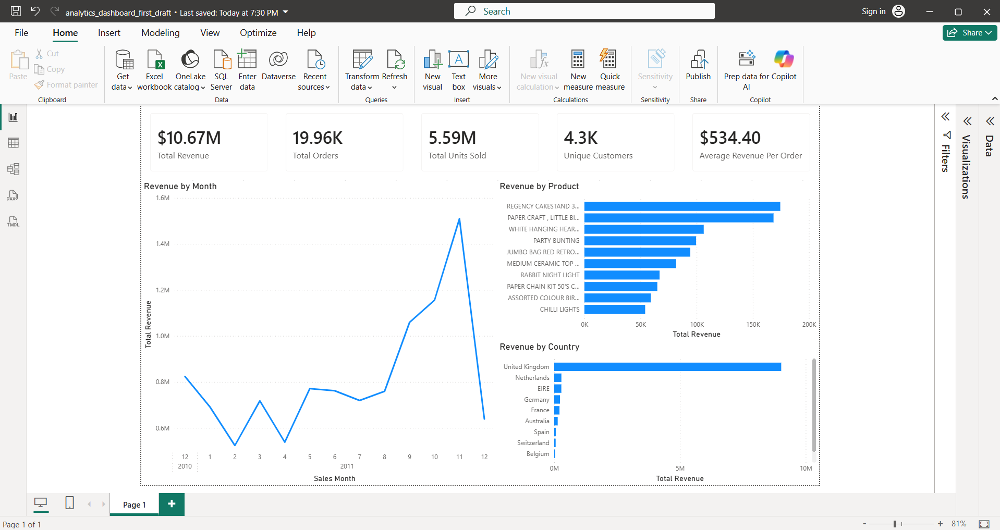

# E-Commerce-Sales-Analytics-Dashboard

## Project Overview
In this project I am cleaning messy retail e-commerce data and using this data to identify trends and to give relevant business insight. This project is very similar to my work done as a Business Data Analyst for Nawlins Vape LLC.

## Tools
- SQL Server (SSMS 22)
- Power BI
- Excel
- GitHub

## Business Questions
1. What are the main revenue trends?
2. What are the best selling products (Highest Revenue)
3. Which countries generate the most revenue?
4. Who are the highest-value customers?
5. How do cancellations affect bottom line?

## Dataset
UCI Online Retail dataset

## Dashboard Preview and Screenshots

### Page 1 - Executive Sales Overview

### Page 2 - Product and Customer Analysis

### Page 3 - Cancellation Impact

### Page 4 - Data Quality Summary

